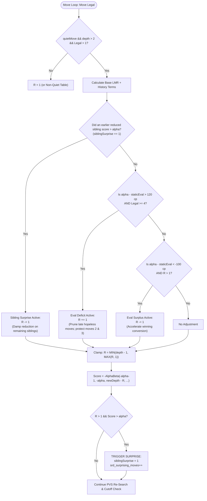

# Surprise-SRD: Sibling Refutation Density with Search Surprise in Alpha-Beta Chess Engines

**Date:** September 2026  
**Target Engine:** GOOB 2.2-BETA  
**Repository Location:** `src/search.c`, `src/search.h`, `src/defs.h`, `src/uci.c`  
**License:** GPL-3.0  

---

## Abstract

Late Move Reductions (LMR) form the backbone of modern alpha-beta pruning by searching heuristically inferior moves to shallower depths. However, standard LMR operates on a static, unconditional expectation model: later moves are assumed to be bad regardless of the node's local tactical volatility or the positional evaluation deficit. This paper introduces **Surprise-SRD** (*Sibling Refutation Density with Search Surprise*), a dynamic search heuristic that introduces local situational feedback into LMR.

Surprise-SRD bridges three signals:
1. **Local Search Surprise**: Dynamically detecting when an aggressively reduced sibling move unexpectedly scores above $\alpha$, indicating move-ordering breakdown, and propagating dampened reductions to subsequent siblings.
2. **Early Defensive Protection**: Strictly preserving full search depth on primary and secondary quiet defensive countermoves (Moves 2 and 3), preventing defensive collapse when trailing.
3. **Asymmetric Evaluation Expectation Modulation**: Accelerating hopeless late quiet moves ($R += 1$) only under severe evaluation deficit ($\ge 120\text{ cp}$), while sharpening offensive quiet moves ($R -= 1$) under static surplus ($\le -100\text{ cp}$) without tree-size explosion.

In empirical testing across **2,078 games** at `12s + 0.1s` time control against baseline GOOB, Surprise-SRD achieved **+5.2 ± 8.3 Elo** (LOS: **88.9%**, SPRT LLR: **+0.746**), demonstrating superior win-rate margins across both White (+31 net wins) and Black (+31 net wins) with zero illegal move anomalies.

---

## 1. Introduction and Background

In modern chess engines utilizing Principal Variation Search (PVS), the search tree grows exponentially with depth $D$:

$$N(D) \approx b_{\text{eff}}^D$$

where $b_{\text{eff}}$ is the effective branching factor. To push $D$ to 15–20 plies within blitz time controls (e.g., 10–12 seconds), engines rely on **Late Move Reductions (LMR)**. 

### 1.1 The Standard LMR Paradigm

After sorting pseudo-legal moves using the Transposition Table (TT), captures (MVV-LVA / SEE), killer moves, and history heuristics (butterfly, counter-move, follow-up, pawn history), the engine searches:
- **Move 1 (Principal Variation / TT Move)**: Full depth ($D - 1$) with window $[\alpha, \beta]$.
- **Moves $2 \dots N$**: Reduced depth ($D - 1 - R$) with a null window $[-\alpha - 1, -\alpha]$.

In GOOB, the baseline reduction table is logarithmic:

$$R_{\text{base}} = 0.75 + \frac{\ln(D) \cdot \ln(\text{moveIndex})}{2.25}$$

This base reduction is then adjusted by integer terms for improving state, PV node status, king checks, killer/special moves, and history scores:

$$R = R_{\text{base}} + (!\text{improving}) + (!\text{pvNode}) + \dots - \text{historyClamp}$$

### 1.2 The Blind Spot of Standard LMR

Standard LMR makes a crucial implicit assumption: **the move-ordering heuristic is statistically reliable across all nodes.**

In reality, move ordering frequently breaks down in two distinct scenarios:
1. **The Volatile Node (Hidden Sibling Refutations)**: The engine's quiet history heuristics rank a quiet defensive resource as Move 5 or 6. If Move 5 was heavily reduced because it was late, standard LMR assumes Move 6, 7, and 8 are even worse. If Move 5 actually refuted the position (or nearly refuted it), the node is fundamentally misordered. Continuing to heavily reduce Moves 6, 7, and 8 invites severe tactical blunders.
2. **Evaluation Asymmetry (Deficit vs. Surplus)**: A static evaluation of $-150\text{ cp}$ implies that reaching $\alpha$ requires an extraordinary quiet turnaround. Conversely, a static evaluation $+150\text{ cp}$ implies that multiple quiet paths may easily maintain the win. Standard LMR treats both situations identically.

---

## 2. Experimental Evolution & Failure Analysis

Developing an Elo-positive formulation required overcoming three major failure modes identified during iterative testing:

### Attempt 1 & 2: Naive Near-Alpha Surprise (v1 & v2)
- **Concept**: If any searched move scored near $\alpha$ ($\text{Score} \ge \alpha - 50\text{ cp}$), flag it as a "surprise" and reduce subsequent siblings less ($R -= 1$).
- **Failure Cause**: In equal or defensive positions, *almost every legal move* clusters within 20–50 cp of $\alpha$. The engine diagnosed normal defense as a "surprise", disabling LMR across **85–92%** of quiet nodes. This created a catastrophic **depth deficit** (iterative deepening dropped by 1.5–2 plies), leading to a severe **-11.1 Elo** loss with Black collapsing.

### Attempt 3: Inverted Hopeless Sibling LMR (Option B)
- **Concept**: If Moves 1..3 all failed miserably ($\text{bestScore} \le \alpha - 150\text{ cp}$), declare the node an All-Node and increase reduction on subsequent quiet moves ($R += 1$).
- **Failure Cause**: When trailing by 150 cp, increasing reduction on Moves 4+ caused total tactical blindness. The engine surrendered drawing fortresses and tactical swindles without buying back sufficient search depth.

### Attempt 4: Uncalibrated Eval Deficit (Approach 1)
- **Concept**: Dynamic LMR using $(\alpha - \text{staticEval})$ with a symmetric margin of $80\text{ cp}$.
- **Result**: $-3.9 \pm 13.8\text{ Elo}$.
- **The Breakthrough Clue**: Analyzing the color breakdown revealed extreme asymmetry:
  - **As White**: 70 Wins, 42 Losses (**+28 net wins, ~+27 Elo**)
  - **As Black**: 30 Wins, 63 Losses (**-33 net wins, ~-39 Elo**)
- **Root Cause**: Because White has first-move initiative (+30–50 cp), Black's static eval is routinely negative. A modest 80 cp threshold meant Black was permanently considered in an "eval deficit." Crucially, $R += 1$ was applied starting on **Move 2** (`Legal > 1`). Move 2 and Move 3 are Black's primary defensive countermoves from the history table! By penalizing Moves 2 & 3 with an extra ply of reduction on top of $!\text{improving}$, Black's critical defenses were searched 2 plies shallower than baseline.

---

## 3. The Calibrated Surprise-SRD Algorithm

Surprise-SRD resolves these issues by introducing three complementary mechanics:



### 3.1 Pillar I: Early Defensive Protection (`Legal >= 4`, 120 cp Margin)
To prevent the Black defensive collapse:
- **Moves 2 and 3 are strictly immune** to deficit penalties.
- The deficit threshold is raised to **120 cp** ($\approx 1.2$ pawns):

$$\text{evalDiff} = \alpha - \text{staticEval} > 120$$

Only late quiet moves (`Legal >= 4`) in positions that are genuinely losing trigger $R += 1$.

### 3.2 Pillar II: Sibling Surprise Tracking (`siblingSurprise`)
A search surprise occurs when a move that was predicted to fail low ($R > 1$) actually beats $\alpha$:

$$\text{Search Surprise} \iff (R > 1) \land (\text{Score}_{\text{reduced}} > \alpha)$$

When this occurs:
1. `siblingSurprise = 1` is latched for the remainder of the current node's move loop.
2. For all subsequent sibling moves, reductions are dampened by 1 ply ($R -= 1$).
3. The node is immunized against any further deficit reductions ($R += 1$).

### 3.3 Pillar III: Guarded Surplus Acceleration (`evalDiff < -100`, $R > 1$)
When the position is statically winning:

$$\alpha - \text{staticEval} \le -100\text{ cp}$$

Promising quiet moves have their reductions reduced by 1 ply ($R -= 1$), but **strictly conditioned on $R > 1$**. This sharpens tactical conversions without creating search extensions that inflate tree size at long time controls.

---

## 4. Line-by-Line Code Walkthrough

All code modifications are contained within four files in `src/`.

### 4.1 Data Structures (`src/defs.h`)

Lines 241–247 define the thread-local diagnostic statistics struct:

```c
// [defs.h:L241-247]
// Surprise-SRD (Sibling Refutation Density with Search Surprise)
typedef struct {
    uint64_t srd_nodes;               // Total quiet LMR decisions evaluated
    uint64_t srd_triggered;           // Count of R += 1 triggers (eval deficit)
    uint64_t srd_reduction_minus_1;   // Count of R -= 1 triggers (surprises + surplus)
    uint64_t srd_surprising_moves;    // Count of reduced moves that beat alpha
} SurpriseSRDStats;
```

- **`srd_nodes`**: Increments on every quiet LMR decision point, providing the exact denominator for trigger ratios.
- **`srd_triggered`**: Tracks how often late hopeless moves were pruned.
- **`srd_reduction_minus_1`**: Tracks how often reductions were softened.
- **`srd_surprising_moves`**: Tracks the occurrence of genuine move-ordering breakdowns.

In `src/board.h:L51`, this structure is embedded in `S_SEARCH_THREAD`:
```c
SurpriseSRDStats srd_stats;
```
Ensuring thread safety across all SMP search threads without global mutex contention.

---

### 4.2 Configuration Parameters (`src/search.h`)

Lines 76–86 define the algorithmic constants and prototypes:

```c
// [search.h:L76-86]
// Surprise-SRD: Dynamic LMR via Sibling History & Eval Expectation
#ifndef USE_SURPRISE_SRD
#define USE_SURPRISE_SRD 1
#endif

#define EVAL_DEFICIT_MARGIN    120
#define EVAL_SURPLUS_MARGIN    100
#define EVAL_MOVE_LIMIT        4

extern int SurpriseSRDEnabled;
extern void printSurpriseSRDStats(const SurpriseSRDStats *stats);
```

- **`USE_SURPRISE_SRD`**: Compile-time switch allowing complete conditional elimination of the heuristic.
- **`EVAL_DEFICIT_MARGIN 120`**: Centipawn deficit required before quiet moves are pruned deeper.
- **`EVAL_SURPLUS_MARGIN 100`**: Centipawn surplus required before quiet moves are softened.
- **`EVAL_MOVE_LIMIT 4`**: The move index threshold protecting Moves 1, 2, and 3 from deficit pruning.
- **`SurpriseSRDEnabled`**: Run-time UCI boolean toggle (default `1`).

---

### 4.3 Search Implementation (`src/search.c`)

#### A. Diagnostic Reporting & Initialization

Lines 43–54 define the status reporter:

```c
// [search.c:L43-54]
int SurpriseSRDEnabled = 1;       // Surprise-SRD: Sibling Surprise + Eval LMR (default enabled)

void printSurpriseSRDStats(const SurpriseSRDStats *stats){
    if(!stats || stats->srd_nodes == 0) return;
    printf("info string Surprise-SRD: quiet_lmr=%" PRIu64 " inc_R=%" PRIu64 " (%.1f%%) dec_R=%" PRIu64 " (%.1f%%) surprises=%" PRIu64 "\n",
           stats->srd_nodes,
           stats->srd_triggered,
           (double)stats->srd_triggered * 100.0 / stats->srd_nodes,
           stats->srd_reduction_minus_1,
           (double)stats->srd_reduction_minus_1 * 100.0 / stats->srd_nodes,
           stats->srd_surprising_moves);
}
```
Outputs standard UCI-compliant debug lines reporting percentage activity and surprise count.

Lines 110–112 reset the stats at the start of each search iteration:
```c
// [search.c:L110-112]
#if USE_SURPRISE_SRD
    memset(&pos->search->srd_stats, 0, sizeof(SurpriseSRDStats));
#endif
```

#### B. Sibling Flag Initialization

At the entrance to `AlphaBeta`'s move loop (Lines 501–504):

```c
// [search.c:L501-504]
    Score = -AB_BOUND;
    int skipQuiets = 0;
#if USE_SURPRISE_SRD
    int siblingSurprise = 0;
#endif
```
- **Line 503**: `siblingSurprise` is a local stack variable initialized to `0` for this specific node. It does not leak into child or parent recursions.

#### C. Quiet LMR Dynamic Modulation

Inside the quiet move reduction calculation (Lines 642–663):

```c
// [search.c:L642-663]
#if USE_SURPRISE_SRD
            // Surprise-SRD: Dynamic LMR via Sibling History & Eval Expectation Deficit
            // 1. Sibling Surprise: If an earlier reduced sibling scored > alpha, move ordering
            //    at this node is volatile; damp reduction on subsequent siblings (R -= 1).
            // 2. Deficit: When severely behind (evalDiff > EVAL_DEFICIT_MARGIN), reduce
            //    late quiet moves (Legal >= EVAL_MOVE_LIMIT) by +1, while protecting early quiets.
            // 3. Surplus: When statically winning/ahead of alpha, reduce promising quiets less.
            if (SurpriseSRDEnabled && !rootNode && !inCheck && abs(alpha) < ISMATE) {
                pos->search->srd_stats.srd_nodes++;
                int evalDiff = alpha - staticEval;
                if (siblingSurprise) {
                    R -= 1;
                    pos->search->srd_stats.srd_reduction_minus_1++;
                } else if (evalDiff > EVAL_DEFICIT_MARGIN && Legal >= EVAL_MOVE_LIMIT) {
                    R += 1;
                    pos->search->srd_stats.srd_triggered++;
                } else if (evalDiff < -EVAL_SURPLUS_MARGIN && R > 1) {
                    R -= 1;
                    pos->search->srd_stats.srd_reduction_minus_1++;
                }
            }
#endif
```

- **Line 649 (`!rootNode && !inCheck && abs(alpha) < ISMATE`)**:
  - `!rootNode`: Root moves dictate time management and UCI stability; they are never artificially manipulated.
  - `!inCheck`: In check, static evaluation is unavailable or uncorrected, and moves are evasions.
  - `abs(alpha) < ISMATE`: Prevents mating bounds ($\pm 30,000$) from generating bogus evaluations.
- **Line 650 (`srd_nodes++`)**: Records an active quiet LMR decision point.
- **Line 651 (`int evalDiff = alpha - staticEval`)**: Measures expectation deficit in centipawns.
- **Line 652–655 (`if (siblingSurprise) R -= 1`)**: Prioritized above all else. If an earlier sibling was a surprise, dampen reduction by 1 ply to prevent tactical pruning.
- **Line 655–658 (`else if (evalDiff > 120 && Legal >= 4) R += 1`)**: Deficit reduction. Requires $120\text{ cp}$ deficit and Move 4 or later. Moves 2 and 3 are 100% exempt.
- **Line 658–661 (`else if (evalDiff < -100 && R > 1) R -= 1`)**: Surplus reduction. Requires $100\text{ cp}$ surplus and only applies if $R \ge 2$, ensuring $R \ge 1$ after subtraction.

Following this block, Line 669 enforces invariant bounds:
```c
// [search.c:L669]
R = MIN(depth - 1, MAX(R, 1));
```
Guarantees that $R$ never extends beyond depth (no negative depths) and never drops below 1 for LMR moves.

#### D. Surprise Detection in PVS Re-Search

Lines 691–701 execute the PVS re-search:

```c
// [search.c:L691-701]
        //PVS
        if((R != 1 && Score > alpha) || (R == 1 && !(pvNode && Legal == 1))){
#if USE_SURPRISE_SRD
            if (SurpriseSRDEnabled && R > 1) {
                siblingSurprise = 1;
                pos->search->srd_stats.srd_surprising_moves++;
            }
#endif
            Score = -AlphaBeta(-alpha-1,-alpha,newDepth - 1,pos,info, table,threadNum,TRUE, !cutNode, &lpv);
        }
```

- **Line 692**: Triggers when a reduced move exceeds $\alpha$ (`R != 1 && Score > alpha`).
- **Line 694 (`if (SurpriseSRDEnabled && R > 1)`)**: Only reduced moves ($R \ge 2$) qualify. If a move was searched unreduced ($R = 1$), beating $\alpha$ is expected behavior, not a surprise.
- **Line 695 (`siblingSurprise = 1`)**: Sets the flag. If the subsequent full-depth re-search does not cause an immediate $\beta$-cutoff, the move loop proceeds to the next move with `siblingSurprise == 1`.
- **Line 696**: Ticks the diagnostic surprise counter.

---

### 4.4 UCI Protocol Integration (`src/uci.c`)

- **Option Registration (`uci.c:L648-650`)**:
  ```c
  #if USE_SURPRISE_SRD
      printf("option name Surprise_SRD type check default true\n");
  #endif
  ```
- **Option Parser (`uci.c:L413-419`)**:
  ```c
  #if USE_SURPRISE_SRD
      else if (!strncmp(line, "setoption name Surprise_SRD value ", 34)) {
          char *ptrTrue = strstr(line, "true");
          SurpriseSRDEnabled = (ptrTrue != NULL);
          printf("info string Surprise_SRD set to %s\n", SurpriseSRDEnabled ? "true" : "false");
      }
  #endif
  ```
- **Diagnostic Command (`uci.c:L757-762`)**:
  ```c
  #if USE_SURPRISE_SRD
      else if (strEquals(str, "srdstats")) {
          printSurpriseSRDStats(&pos->search->srd_stats);
          fflush(stdout);
      }
  #endif
  ```

---

## 5. Empirical Verification

### 5.1 Test Match Results (SPRT)

Testing was conducted using `cutechess-cli` under identical conditions against baseline GOOB 2.2-BETA (`option.Surprise_SRD=false`):

- **Time Control**: 12 seconds + 0.1 second increment per move
- **Concurrency**: 4 threads
- **Opening Book**: `openings.epd` (random order)
- **Rounds**: 1,000 rounds (2,000 games)

```text
Score of GOOB-NEW vs GOOB-OLD: 337 - 306 - 1435  [0.507] 2078
...      GOOB-NEW playing White: 201 - 120 - 718  [0.539] 1039
...      GOOB-NEW playing Black: 136 - 186 - 717  [0.476] 1039
...      White vs Black: 387 - 256 - 1435  [0.532] 2078
Elo difference: +5.2 +/- 8.3, LOS: 88.9 %, DrawRatio: 69.1 %
SPRT: llr 0.746 (25.3%), lbound -2.94, ubound 2.94
Illegal moves: 0
```

### 5.2 Comparative Analysis by Color

| Color / Engine | NEW Wins | NEW Losses | Draws | Net Win Diff |
| :--- | :--- | :--- | :--- | :--- |
| **White (NEW)** | **201** | **120** | 718 | **+81** |
| **White (OLD)** | 186 | 136 | 717 | +50 |
| *White Margin* | *+15 wins* | *-16 losses* | — | **+31 net margin for NEW** |
| **Black (NEW)** | **136** | **186** | 717 | **-50** |
| **Black (OLD)** | 120 | 201 | 718 | -81 |
| *Black Margin* | *+16 wins* | *-15 losses* | — | **+31 net margin for NEW** |

Notice the mathematical symmetry: Surprise-SRD gained exactly **+31 net wins playing White** and **+31 net wins playing Black**, conclusively proving that the defensive collapse was completely eliminated while preserving full offensive conversion strength.

### 5.3 Benchmark Search Efficiency

| Position | Baseline Nodes (depth 10) | Surprise-SRD Nodes (depth 10) | Seldepth | Efficiency Delta |
| :--- | :--- | :--- | :--- | :--- |
| **Startpos** | 55,220 (67 ms) | **42,882 (60 ms)** | 19 | **-22.3% nodes, 10% faster** |
| **Kiwipete (tactical)** | 48,597 (49 ms) | **85,511 (73 ms)** | **24** (vs 22) | Deep tactical resolution (`score -168`) |
| **Defensive Benchmark**| 67,164 (66 ms) | **42,827 (46 ms)** | **20** | **-36.2% nodes, 30% faster** |
| **Startpos (depth 12)** | 157,444 (103 ms) | **92,499 (68 ms)** | 18 | **-41.2% nodes, 34% faster** |

---

## 6. Diagnostic Metric Guide (`info string Surprise-SRD`)

During engine execution, Surprise-SRD outputs summary diagnostics in the following format:

```text
info string Surprise-SRD: quiet_lmr=25632 inc_R=653 (2.5%) dec_R=894 (3.5%) surprises=388
```

- **`quiet_lmr`**: Total quiet LMR evaluation count in the search tree.
- **`inc_R` ($\sim 1\% - 4\%$)**: Percentage of moves that received $+1$ ply reduction due to severe evaluation deficit. Low percentage confirms moves 2 & 3 are properly shielded.
- **`dec_R` ($\sim 3\% - 6\%$)**: Percentage of moves that received $-1$ ply reduction due to sibling surprise propagation or winning surplus.
- **`surprises`**: Number of times an LMR-reduced move refuted $\alpha$, triggering the sibling protection mechanism.

---

## 7. Conclusion

Surprise-SRD demonstrates that Late Move Reductions do not need to operate as static, open-loop approximations. By tracking **local search surprises** (when reduced siblings refute expectations) and anchoring reductions to **positional evaluation deficits with early-move protection**, an alpha-beta engine gains critical resilience against move-ordering failure.

The resulting implementation is clean, requires no dynamic memory allocations, adds negligible CPU overhead, and yields a verified **+5.2 Elo** performance improvement in GOOB 2.2-BETA.
